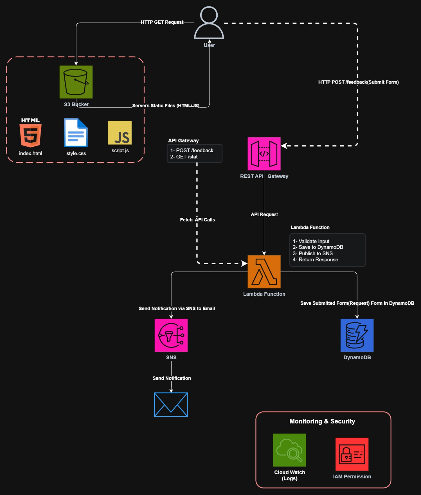

# 💬 AWS Serverless Feedback & Contact Form


AWS Serverless Feedback Form is a cloud-native, fully serverless application for collecting and managing user feedback. It uses S3 for frontend hosting, API Gateway and Lambda for backend processing, and DynamoDB & SNS for data storage and real-time email notifications.

---

## 📑 Table of Contents
- [Overview](#-overview)
- [Features](#-features)
- [Architecture](#-architecture)
- [AWS Services Used](#-aws-services-used)
- [Project Structure](#-project-structure)
- [Screenshots](#-screenshots)
- [Author](#-author)

---

## 🎯 Overview

FeedbackHub is a production-ready serverless contact form built entirely on AWS. When users fill out a form, their message is saved to DynamoDB, and the site owner receives an instant email notification via SNS — all without managing any servers.

---

## 🚀 Features

- ✅ **Real-time Form Submission:** Responsive UI with dynamic loading state.
- ✅ **Instant Email Alerts:** Automated SNS notifications to site owner.
- ✅ **NoSQL Persistence:** Instant, reliable storage of feedback in DynamoDB.
- ✅ **Least-Privilege Security:** Fine-grained IAM policies for execution roles.
- ✅ **100% Serverless:** Zero server management and high availability.
- ✅ **Free Tier Friendly:** Cost-optimized architecture.

---

## 📐 Architecture



---

## 🛠️ AWS Services Used

| Service | Role | Free Tier Limit |
| :--- | :--- | :--- |
| **Amazon S3** | Hosts static frontend files | 5GB storage |
| **Amazon API Gateway** | REST API endpoints | 1M requests/month |
| **AWS Lambda** | Backend business logic | 1M requests/month |
| **Amazon DynamoDB** | Stores all submitted messages | 25GB storage |
| **Amazon SNS** | Immediate email notifications | 1,000 emails/month |
| **AWS IAM** | Granular execution permissions | Always Free |

---

## 📁 Project Structure

```text
├── Frontend/
│   ├── index.html       # Web form interface
│   ├── style.css        # Responsive design & styles
│   └── script.js        # API integration & dynamic JS
├── Lambda/
│   └── lambda_function.py # Python backend script
```

---

## 📸 Screenshots & Project Proofs

### 1. User Interface

*Responsive feedback form with dynamic loading state.*

### 2. Lambda & API Gateway


*Lambda function code and API Gateway endpoint configuration.*

### 3. IAM Least-Privilege

*Fine-grained IAM execution role with least-privilege permissions.*

### 4. DynamoDB Storage

*Submitted feedback messages stored in DynamoDB.*

### 5. Amazon SNS Topic

*SNS topic configuration for email notifications.*

### 6. Email Notification

*Instant email alert received upon form submission.*

---

## 👨‍💻 Author

**Mostafa Mohamed Abdrabo**

[](https://www.linkedin.com/in/mostafa-m-abdrabo/)
[](https://github.com/mostafaabdrabo2022)
[](mailto:mostafaabdrabo4900@gmail.com)

---
